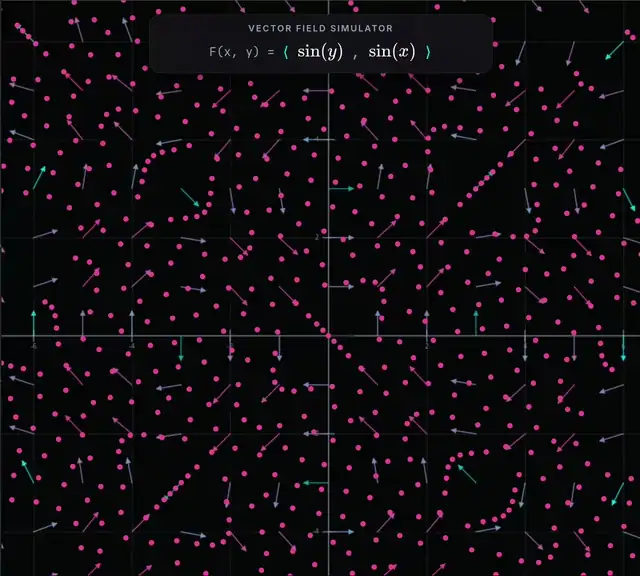

# Vector Field Simulator

An interactive, browser-based simulator for exploring two-dimensional vector fields. The application displays a vector field as arrows and animates particles through it, helping students connect symbolic definitions with direction, speed, trajectories, and flow.

**[Open the live simulator](https://mbwatson.github.io/vector-field/)**

[](https://mbwatson.github.io/vectorField/)

## Why I Built It

I originally built this application while teaching multivariable calculus to high school students. Tools such as [Desmos](https://www.desmos.com/calculator) and [CalcPlot3D](https://c3d.libretexts.org/CalcPlot3D/index.html) helped with many topics, but I wanted a more dynamic way for students to develop intuition about vector fields—especially the fluid-flow interpretation of curl.

Rather than showing only a static collection of arrows, the simulator lets students place and draw with particles, watch those particles move through a field, and change the field itself. The goal is to make vector fields experimentable, not merely visible.

## What You Can Explore

- Compare a field's symbolic definition with its geometric appearance.
- Observe particle trajectories and local changes in direction and speed.
- Draw shapes and watch them stretch, rotate, compress, or shear.
- Choose from preset fields or edit either component of $F(x,y)$ directly.
- Pan and zoom to inspect different regions of a field.
- Adjust simulation speed, vector density, particle size, and particle spacing.
- Independently show or hide particles, vectors, axes, and grid lines.

The initial viewport is centered on the origin and spans $[-5,5]$ horizontally. Its vertical range adapts to the browser window, and the viewport can be panned or zoomed during use.

## Using the Simulator

### Particles and Playback

- Select **Play** or **Pause** to control the animation.
- Click the plane to add one particle.
- Click and drag to paint a line or shape with particles.
- Select **Clear** to remove all particles.
- Select **Seed Grid** to replace them with a regularly spaced grid.

Particles move with the velocity defined by the vector field at their current positions. Their paths therefore trace numerical approximations of the field's integral curves.

### Custom Vector Fields

Choose an example from **Presets** in the function editor, or click either displayed component of $F(x,y)$ to edit it. Press **Enter** to apply an expression or **Escape** to cancel the edit. Invalid expressions display an error and leave the previous field unchanged.

Supported syntax includes:

- Variables: `x`, `y`
- Operators: `+`, `-`, `*`, `/`, `^`
- Constants: `pi`, `e`
- Functions: `sin`, `cos`, `tan`, `sec`, `csc`, `cot`, `asin`, `acos`, `atan`, `sinh`, `cosh`, `tanh`, `exp`, `ln`, `log`, `sqrt`, and `abs`
- Implicit multiplication: `2x`, `xy`, `2sin(x)`, and `(x+1)(x-1)`

For example, enter `-y` as the first component and `x` as the second to create a rotational field $F(x,y)=\langle-y,x\rangle$.

### Viewport and Display Controls

- Scroll over the plane to zoom in or out.
- Pan with a right-button drag, middle-button drag, or <kbd>Space</kbd> + drag.
- On a touchscreen, use two fingers to pan and pinch to zoom. Use one finger to draw particles.
- Use the settings panel to show or hide particles, vectors, axes, and grid lines.
- Use the sliders to change simulation speed, vector spacing, particle size, and the spacing of the seeded particle grid.

## Classroom Use

The simulator is designed for inquiry-based instruction: students **predict**, **experiment**, **observe**, and **explain**. This approach develops geometric intuition before—or alongside—the formal study of vector fields, integral curves, divergence, and curl.

Activities can be as simple as asking students to predict one particle's path, or as open-ended as drawing a shape and explaining how a field will deform it. Many activities are also accessible before multivariable calculus and can motivate ideas such as transformations, composition, and local behavior.

See **[Classroom Activity Ideas](CLASSROOM.md)** for ready-to-use prompts, discussion questions, and teaching suggestions.

## Local Development

The application uses plain HTML, CSS, and JavaScript, with Vite providing the local development server and production build.

### Requirements

- A modern web browser
- Node.js 20.19+ or 22.12+

### Run Locally

Clone the repository, install dependencies, and start the development server:

```sh
git clone https://github.com/mbwatson/vectorField.git
cd vectorField
npm install
npm run dev
```

Vite prints the local URL when the server starts.

Create and locally preview the production build with:

```sh
npm run build
npm run preview
```

## Technical Notes

- The visualization is built with [p5.js](https://p5js.org/), installed as an npm dependency.
- The application source is organized as ES modules under `src/` and bundled by Vite for production.
- A small, purpose-built expression parser evaluates custom field components and formats them for display.
- [MathJax](https://www.mathjax.org/) and Google Fonts are loaded from external services; Font Awesome is bundled with the application.
- The application is entirely client-side and does not send entered vector functions to a server.
